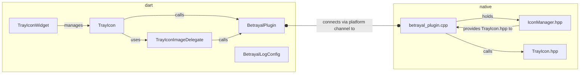

[](https://github.com/benthillerkus/betrayal/actions/workflows/score.yml)

![joke shield[^1]](https://img.shields.io/badge/supports-windows%202000*-blue)


# betrayal

A capable tray icon[^2] plugin for Windows. Manage multiple icons 👨‍👩‍👦‍👦, generate their images at runtime 🎨 and compose them as if they were a regular widget 🎶

## Features

- Control multiple tray icons
- Many options for setting the tray icons image
  - `.ico` file either from the file system or the Flutter assets directory
  - Set the pixels directly through an image buffer - you can use this to dynamically create an image via canvas!
  - Use default system icons like the ❔ or the elevation prompt 🛡️
- Widget api - treat the tray icon as part of your UI and compose it in your build methods

## Usage
```dart
import 'package:betrayal/betrayal.dart';

// ...

@override
Widget build(BuildContext context) => MaterialApp(
  home: Scaffold(
    appBar: AppBar(
      title: const Text("Look at the system tray 👀")
    ),
    body: Center(
      child: TrayIconWidget(
        winIcon: WinIcon.application,
        tooltip: "Here I am!"
        child: FlutterLogo()
      )
    )
  )
);
```

Please refer to the [example subdirectory](https://github.com/benthillerkus/betrayal/tree/main/example) for more [information](https://github.com/benthillerkus/betrayal/blob/main/example/README.md) and code.

# Development
## TBD before v1

- FIXME Find out all possible errors and repackage / handle them
- TODO Find out, communicate and memoize the correct system metrics (icon resolution)
- TODO Support interaction

## Style

Use [conventionalcommits.org/en/v1.0.0](https://www.conventionalcommits.org/en/v1.0.0/) for commits. <br>
Use [dart.dev/guides/language/effective-dartdocumentation](https://dart.dev/guides/language/effective-dart/documentation) for docs.

## Overview



[^1]: This is a lie. Flutter does not support Windows 2000. Betrayal.
[^2]: It's actually called the notification area [according to Raymond Chen](https://devblogs.microsoft.com/oldnewthing/20030910-00/?p=42583#:~:text=Summary%3A%20It%20is%20never%20correct%20to%20refer%20to%20the%20notification%20area%20as%20the%20tray.%20It%20has%20always%20been%20called%20the%20%E2%80%9Cnotification%20area%E2%80%9D.)
