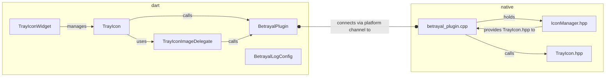

<p align="center">
  <a href="https://betrayal.bent.party">
    
  </a>
</p>

<p align="center">
A capable tray icon plugin for Windows.
</p>

<table border="0" align="center">
  <tr>
    <td>
    </td>
  </tr>
  <tr>
    <td>
      <a href="https://pub.dev/packages/betrayal">🔗 package on pub.dev</a><br>
      <a href="https://github.com/benthillerkus/betrayal">🔗 source on github.com</a><br>
      <a href="https://pub.dev/documentation/betrayal">🔗 dart docs api reference</a>
    </td>
    <td>
      <pre><br>
Manage multiple icons 👨‍👩‍👦‍👦,<br>generate their images at runtime 🎨<br>and compose them just like a widget 🎶
        </pre>
    </td>
  </tr>
</table>

## Features

[](https://pub.dev/packages/betrayal/score)
[](https://pub.dev/packages/betrayal/versions)
[![joke shield[^1]](https://img.shields.io/badge/supports-windows%202000*-blue)](#)
[](https://pub.dev/publishers/bent.party/packages)

- Control multiple tray icons
- Many options for setting the tray icons image
  - `.ico` file either from the file system or the Flutter assets directory
  - Set the pixels directly through an image buffer - you can use this to dynamically create an image via canvas!
  - Use default system icons like the ❔ or the elevation prompt 🛡️
- Widget api - treat the tray icon as part of your UI and compose it in your build methods


https://user-images.githubusercontent.com/29630575/163495162-1cbdbc94-095f-48c6-ad86-a1f5ee809481.mp4


## Usage
```dart
import 'package:betrayal/betrayal.dart';

// ...

@override
Widget build(BuildContext context) => MaterialApp(
  home: Scaffold(
    appBar: AppBar(
      title: const Text("Look at the system tray 👀")
    ),
    body: Center(
      child: TrayIconWidget(
        winIcon: WinIcon.application,
        tooltip: "Here I am!"
        child: FlutterLogo()
      )
    )
  )
);
```

Please refer to the [example subdirectory](https://github.com/benthillerkus/betrayal/tree/main/example) for more [information](https://github.com/benthillerkus/betrayal/blob/main/example/README.md) and code.

# Development

## Style

Use [conventionalcommits.org/en/v1.0.0](https://www.conventionalcommits.org/en/v1.0.0/) for commits. <br>
Use [dart.dev/guides/language/effective-dartdocumentation](https://dart.dev/guides/language/effective-dart/documentation) for docs.

## Overview



[^1]: This is a lie. Flutter does not support Windows 2000. Betrayal.
